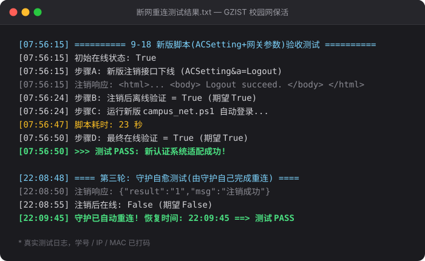

# GZIST 校园网自动登录保活工具

广州理工学院校园网（城市热点 Dr.COM / eportal，门户 `10.0.10.252`）自动登录与保活工具。
适配 **2026 年 9 月学校认证系统升级后的新接口** —— 老脚本集体失效之后，这是目前实测可用的版本。

**已实测**：主动注销下线后约 **15~25 秒** 自动重连恢复；重启 / 休眠唤醒 / 拔插网线后约 **1 分钟内** 恢复。全程无需人工干预。

**[⬇️ 下载最新版 ZIP](../../releases/latest)** &nbsp;·&nbsp; [📖 图文使用说明（在线）](https://xiaomai1011.github.io/GZIST-campusnet-autologin/) &nbsp;·&nbsp; [常见问题](#常见问题) &nbsp;·&nbsp; [工作原理](#工作原理简要)



---

## 🚀 三步上手（新用户从这里开始）

1. **下载 ZIP，解压到一个固定文件夹**（例如 `D:\校园网自动登录\`）—— 之后就一直用这个文件夹
2. **双击 `重新配置账号.bat`**，输入学号和校园网密码（只填这一次，保存在本机）
3. **双击 `安装开机自启.bat`** —— 它同时装好开机自启与后台保活，之后的掉线都会自动重连

> ⚠️ **以后所有操作都用这同一个文件夹。** 脚本按"自己所在的目录"找配置，换个文件夹双击就会报"未找到配置文件"。同理，**别把解压出来的文件夹改名或移动**（开机自启里记着它的路径）。
>
> 想确认保活是不是真的在跑：双击 `诊断检测.bat`，看**第 5 项**是否显示「运行中」。
> 想直观验证重连：双击 `注销测试.bat` 把自己踢下线，等十几秒看是否自动恢复。

---

## 它解决什么问题

校园网是门户认证（Web Portal）模式，每次**重启电脑、休眠唤醒、拔插网线、IP 变化**之后都要重新打开浏览器登录一遍；挂着不动也会被服务器踢下线。

本工具常驻后台，每 10 秒静默探测一次网络，一旦发现掉线就自动重新认证，你只需要配置一次。

## 功能特性

- **自动登录**：向 eportal 新版接口（`ACSetting&a=Login`）发送认证请求，紧跟网关 302 跳转携带权威参数，旧接口（`Portal&a=login`）自动兜底
- **掉线保活**：每 10 秒探测一次网络（仅一个小 HTTPS 请求），检测到掉线才发登录请求，对学校和本机几乎零负担
- **可靠的在线判断**：用 HTTPS 证书校验检测联网状态 —— 校园网未认证时网关会劫持 HTTP 请求返回假页面，旧脚本的 HTTP 探测会误判在线，本工具不会
- **开机自启**：注册表 Run 键 + VBS 静默启动器，登录 Windows 后无窗口后台运行（无需管理员权限）
- **单实例保护**：重复双击启动不会产生多个守护进程
- **零依赖**：纯 PowerShell + Windows 自带组件，Win10/11 开箱即用

## 环境要求

| 项目 | 要求 |
|---|---|
| 系统 | Windows 10 / 11 |
| 运行时 | PowerShell 5.1（系统自带，无需安装） |
| 权限 | 普通用户即可，**无需管理员** |
| 网络 | 接入广州理工学院校园网（有线 / 无线均可） |

## 文件说明

| 文件 | 作用 |
|---|---|
| `campus_net.ps1` | **核心脚本**：登录 / 在线检测 / 保活守护 |
| `重新配置账号.bat` | 配置或修改学号、密码 |
| `校园网登录.bat` | 手动登录一次（测试用） |
| `诊断检测.bat` | 一键检查：在线状态、配置、**保活是否在运行**、**开机自启指向**（**出问题先跑这个**） |
| `注销测试.bat` | 主动注销下线，验证自动重连效果 |
| `安装开机自启.bat` | 注册开机自启并立即启动保活守护（推荐） |
| `启动后台保活.bat` | 不装自启，临时启动一次守护 |
| `卸载开机自启.bat` | 移除开机自启并结束守护进程 |
| `silent_start.vbs` | 静默启动器（被 bat 调用，避免弹出窗口） |
| `install_autostart.ps1` | 自启安装逻辑（被 `安装开机自启.bat` 调用） |
| `logout.ps1` | 注销逻辑（被 `注销测试.bat` 调用） |
| `index.html` | 图文详细教程 + 常见问题（也是 [GitHub Pages 首页](https://xiaomai1011.github.io/GZIST-campusnet-autologin/)，离线时可直接双击打开） |

> 倒数三个是内部脚本，由 bat 自动调用，不需要手动运行。

## 工作原理（简要）

1. 掉线时访问任意 HTTP 网站会被网关 302 劫持到认证页，URL 中带有网关登记的 `wlanuserip / wlanusermac / wlanacip`
2. 脚本捕获该跳转，**立刻**携带这些参数向 `/eportal/?c=ACSetting&a=Login` 发起认证（顺序很关键，网关需要先为该 IP 建立会话）
3. 登录后用 HTTPS 探测验证是否真正恢复

<details>
<summary><b>点击查看真实测试日志（2026-09-18 新认证系统验收）</b></summary>

```
[07:56:15] ========== 9-18 新版脚本(ACSetting+网关参数)验收测试 ==========
[07:56:15] 初始在线状态: True
[07:56:15] 步骤A: 新版注销接口下线 (ACSetting&a=Logout)
[07:56:15]   注销响应: <html>... <body> Logout succeed. </body> </html>
[07:56:24] 步骤B: 注销后离线验证 = True (期望 True)
[07:56:24] 步骤C: 运行新版 campus_net.ps1 自动登录...
[07:56:47]   脚本耗时: 23 秒
[07:56:50] 步骤D: 最终在线验证 = True (期望 True)
[07:56:50] >>> 测试 PASS: 新认证系统适配成功!
[07:56:50] ========== 测试结束 ==========

[22:08:48] ==== 第三轮: 守护自愈测试(由守护自己完成重连) ====
[22:08:50] 注销响应: {"result":"1","msg":"注销成功"}
[22:08:55] 注销后在线: False (期望 False)
[22:09:45] 守护已自动重连! 恢复时间: 22:09:45 ==> 测试 PASS
[22:09:45] ==== 测试结束 ====
```

（原日志中的学号、IP、MAC 已打码处理）
</details>

## 常见问题

- **提示"登录失败 ret_code=8"**
  多为密码错误，或该账号正在别处在线。先用手机浏览器打开 `10.0.10.252` 注销本机，再重试。
- **改了校园网密码**
  重新运行 `重新配置账号.bat`。
- **开着 VPN 时检测不准 / 掉线后不自动重连**
  VPN 尤其 **TUN 模式（虚拟网卡）** 会接管系统路由，把发往校园网关的请求也一并吞进隧道。后果是：掉线时网关那个 302 跳转捕获不到 —— 而登录必需的 `wlanuserip / wlanusermac / wlanacip` 参数就在跳转里，登录因此无法完成；同时在线 / 离线判断也会失真（可能显示在线其实已掉线）。**测试和日常使用请先关闭 VPN**，只保留校园网本身的连接。
- **任务栏出现 PowerShell 窗口**
  运行一次 `安装开机自启.bat`（会切换为 VBS 静默启动，之后无窗口）。
- **不确定守护有没有在跑**
  运行 `诊断检测.bat`，看**第 5 项**：显示「运行中」就是真的在跑（用命名互斥锁判断，比看进程列表准）。没在跑就双击 `启动后台保活.bat`；**第 6 项**会告诉你开机自启指向的是哪个目录。
- **想换检测间隔**
  编辑 `campus_net.ps1` 中的 `$CheckInterval`（单位：秒，默认 `10`）。不建议设得过短。
- **想彻底卸载**
  先运行 `卸载开机自启.bat`，再删掉整个文件夹即可（配置和日志都在一起，不会残留到系统别处）。
- **学校又升级了认证系统，脚本失效怎么办**
  9-18 升级后旧接口全部返回 500，需要抓取新的登录页地址重新适配。提交 Issue，附上浏览器 F12 → Network 里新登录请求的完整 URL。

## 声明

- 本工具仅适配广州理工学院校园网环境，仅供学习交流与个人便利使用，请遵守学校网络使用规定
- 密码仅以 Base64 编码保存在本机 `campusnet_config.json`（编码混淆，**非加密**），请勿将该文件或含配置的目录分享给他人
- 请勿将检测间隔设置得过短给学校服务器造成压力

## 致谢

- 登录接口格式参考 [YT-O5/GZIST_CampusNet_AutoLogin](https://github.com/YT-O5/GZIST_CampusNet_AutoLogin)（MIT License），该项目已失效删除，本项目在其基础上重写并适配了 2026-09 的新认证系统

## License

[MIT](LICENSE)
