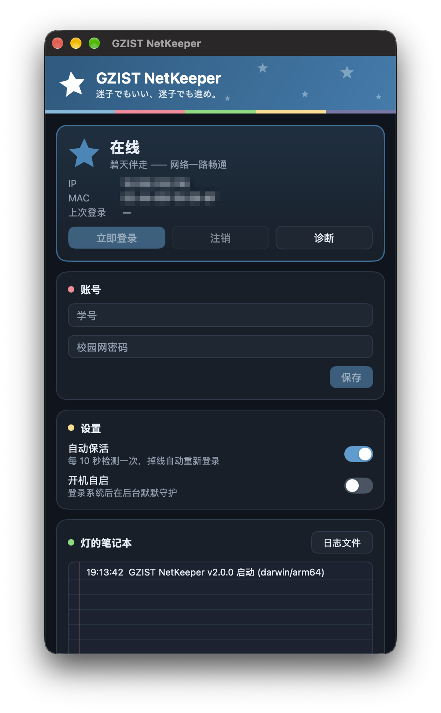
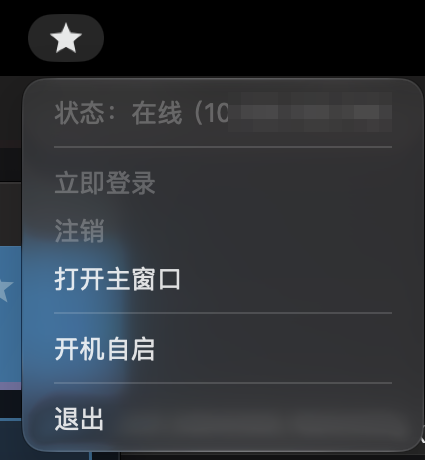

<div align="center">


# GZIST NetKeeper

**广州理工学院校园网 · 自动登录 & 掉线保活客户端**

[](https://github.com/xiaomai1011/GZIST-NetKeeper/releases/latest)
[](https://github.com/xiaomai1011/GZIST-NetKeeper/releases)
[](https://github.com/xiaomai1011/GZIST-NetKeeper/actions/workflows/release.yml)
[](LICENSE)
<br>


[](https://github.com/egoist/mygo)

**[⬇️ 下载](https://github.com/xiaomai1011/GZIST-NetKeeper/releases/latest)** · [安装](#-安装) · [快速上手](#-快速上手) · [日常使用](#-日常使用) · [常见问题](#-常见问题)

</div>

---

填一次学号和密码，之后它就待在托盘（macOS 是菜单栏）里，**每 10 秒检查一次网络，掉线就自动重新认证**。
重启电脑、休眠唤醒、拔插网线、被服务器踢下线，通常半分钟内就能恢复，不用再打开浏览器手动登录。

<p align="center">
  
  &nbsp;&nbsp;
  
</p>
<p align="center"><sub>左：主窗口　右：菜单栏 / 托盘菜单（macOS 实机截图，IP 与 MAC 已打码）</sub></p>

## 📦 安装

到 **[Releases 页面](https://github.com/xiaomai1011/GZIST-NetKeeper/releases/latest)** 下载对应系统的文件。文件名里的 `x64` / `amd64` 是常见的 Intel、AMD 电脑，`arm64` 是 Apple M 系列芯片和 ARM 电脑：

| 系统 | 选哪个文件 | 怎么装 |
|---|---|---|
| **Windows 10 / 11** | `GZIST-NetKeeper-x.y.z-windows-x64-setup.exe`（骁龙等 ARM 电脑选 `arm64`） | 双击安装，**不需要管理员权限** |
| **macOS** | `GZIST-NetKeeper-x.y.z-macos-arm64.dmg`（M 系列芯片）/ `-macos-x64.dmg`（Intel） | 打开 dmg，把 App 拖进「应用程序」 |
| **Linux（Debian / Ubuntu）** | `gzist-netkeeper_x.y.z_amd64.deb`（ARM 选 `arm64`） | `sudo apt install ./gzist-netkeeper_*.deb` |
| **Linux（其他发行版）** | 无需下载，一行命令安装（会自动更新） | `curl -fsSL https://github.com/xiaomai1011/GZIST-NetKeeper/releases/latest/download/install.sh \| sh` |

### 第一次打开被系统拦住？

安装包没有购买商业代码签名证书，第一次打开时系统会弹出安全提示，按下面操作放行即可，只需要做一次：

- **Windows**：出现「Windows 已保护你的电脑」时，点 **更多信息 → 仍要运行**。
- **macOS**：提示「无法打开」时，打开 **系统设置 → 隐私与安全性**，在页面底部点 **仍要打开**。
  如果仍然打不开，可以在终端执行：
  ```sh
  xattr -dr com.apple.quarantine "/Applications/GZIST NetKeeper.app"
  ```
- **Linux**：托盘图标需要 `libayatana-appindicator3`。deb 包会自动安装它；用 install.sh 安装时需要手动装：
  ```sh
  sudo apt install libayatana-appindicator3-1        # Debian / Ubuntu
  sudo dnf install libayatana-appindicator-gtk3      # Fedora
  ```
  缺少这个库也能用，只是没有托盘图标。这时程序会直接显示主窗口，关掉窗口后仍在后台保活，再次打开程序就能找回窗口。

## 🚀 快速上手

1. **打开 GZIST NetKeeper**，第一次运行会自动弹出主窗口。
2. 在 **账号** 卡片里填写 **学号** 和 **校园网密码**，点 **保存**。程序会马上登录，状态卡变成「在线」就说明成功了。
3. 在 **设置** 卡片里打开 **开机自启**。以后开机后它会在后台静默运行，不弹窗口。

完成后就可以把窗口关掉了。**关闭窗口不会退出程序**，它会继续在托盘里工作。

> 💡 想确认自动重连是否有效：点 **注销** 把自己踢下线，再点 **立即登录**，或者打开自动保活等十几秒，看状态是否恢复为「在线」。

## 🌟 日常使用

### 看托盘图标就够了

| 图标 | 含义 |
|---|---|
| ★ 实心星 | 在线 |
| ☆ 空心星 | 离线（开着自动保活时会自动重连） |
| 星里有圆点 | 正在登录 |
| 星里有「!」 | 需要你处理，打开主窗口查看原因 |

> Windows / Linux 上的托盘图标是彩色的。macOS 菜单栏图标会自动跟随系统的深色 / 浅色外观。

### 托盘菜单

点击托盘图标（Windows 上左键单击会直接打开主窗口，右键弹出菜单）：

- **状态**：当前是否在线，以及本机 IP
- **立即登录 / 注销**：手动登录或下线
- **打开主窗口**
- **开机自启**：打勾表示开启
- **重启以更新**：有新版本下载好时才会出现
- **退出**：彻底退出程序，退出后就不再保活

### 主窗口

| 区域 | 作用 |
|---|---|
| **状态卡** | 在线状态、本机 IP / MAC、上次登录时间；还有 **立即登录**、**注销**、**诊断** 三个按钮 |
| **账号** | 修改学号或密码。密码框留空表示不修改已保存的密码 |
| **设置 · 自动保活** | 每 10 秒检测一次，掉线自动重登。关闭后只在你手动点登录时才登录 |
| **设置 · 开机自启** | 登录系统后自动在后台运行 |
| **日志** | 最近 200 条记录。点 **复制脱敏日志** 可复制学号、IP、MAC 已打码的日志；点 **日志文件** 可以打开完整日志 |

### 自动保活是怎么工作的

- 检测到掉线后会立即登录。如果登录失败，会依次等待 **10 秒 → 30 秒 → 1 分钟 → 2 分钟** 后再重试，不会一直刷服务器。
- 电脑从休眠中唤醒后会马上检测一次，不用等下一个 10 秒。
- 你手动点了 **注销** 之后，自动保活会暂停，直到你再次点 **立即登录**，免得刚注销就被自动登录回去。
- 如果服务器明确拒绝登录（学号或密码错误、账号已在其他设备在线，或 `ret_code=2` / `8`，原因见下方常见问题），重试也解决不了，所以程序会 **暂停自动重试** 并弹出通知，不会再拿错误的密码反复尝试。状态卡里会给出处理建议，处理完后点 **立即登录**（改了密码则点 **保存**）。
- 服务器已回复「认证成功」但外网还没放通时，程序会等待生效，不会重复提交登录。
- 连不上认证服务器（比如不在校园网）时，程序会快速放弃这一轮，不再逐个尝试参数组合，按上面的间隔稍后再试。

### 自动更新

程序会在联网后检查新版本，之后每 6 小时检查一次。新版本会在后台下载好，然后在托盘菜单和主窗口中提示 **重启以更新**，点一下就会完成更新。
通过 deb 安装的版本只会提醒，请用 `apt` 或重新下载 deb 来升级。

## ❓ 常见问题

<details>
<summary><b>提示 ret_code=8，自动重试被暂停了</b></summary>

通常是 **密码错误**，或者网关登记的 IP / MAC 和本机对不上。按顺序试试：

1. 确认学号和密码正确（可以在 **账号** 里重新填写并保存）；
2. 用手机连接校园网，浏览器打开 `10.0.10.252`，把这台电脑注销；
3. 电脑断开 Wi-Fi 后重新连接（或者拔插网线），让它重新获取 IP；
4. 回到程序点 **立即登录**。
</details>

<details>
<summary><b>提示 ret_code=2</b></summary>

这个账号已经在其他设备上登录了。先在那台设备上注销，或者按上一条的方法用手机打开 `10.0.10.252` 注销，然后点 **立即登录**。
</details>

<details>
<summary><b>开着 VPN / 代理时检测不准，掉线后不重连</b></summary>

TUN 模式（虚拟网卡）的 VPN 会接管系统路由，网关的认证跳转和在线检测都会失真。使用校园网认证时请先关闭 VPN，或者把 `10.0.10.252` 和校园网网段设置为直连。
</details>

<details>
<summary><b>不知道哪里出了问题</b></summary>

点状态卡里的 **诊断**。它会依次检查 **网卡 → 网关跳转 → 认证服务器 → 外网**，每一步的结果都写在日志里。提 Issue 时请点日志卡片上的 **复制脱敏日志** 再粘贴：密码始终隐藏为 `***`，学号、校园网 IP、MAC 也会打码（如 `2023***001`、`10.20.*.*`、`AA-BB-CC-**-**-**`）。本机的日志文件保留原始内容。
</details>

<details>
<summary><b>改了校园网密码</b></summary>

在 **账号** 卡片里填写新密码，点 **保存**，程序会用新密码重新登录。
</details>

<details>
<summary><b>密码存在哪里，安全吗？</b></summary>

密码保存在系统自带的凭据库里：macOS 是 **钥匙串**，Windows 是 **凭据管理器**，Linux 是 **Secret Service**（GNOME Keyring、KWallet 等）。
如果系统里没有可用的凭据库（常见于没有桌面环境的 Linux），会退回到数据目录下的一个仅本人可读（`0600`）的文件，界面上会提示这一点。
程序只会与学校的认证服务器通信，检查更新时会访问 GitHub，不会上传任何数据。

需要注意：Dr.COM 认证页本身是通过 HTTP（`http://10.0.10.252:801`）明文提交学号和密码的，网页登录也一样。系统凭据库只保护密码在本机的存储，无法改变校园认证链路自身的明文传输属性。
</details>

<details>
<summary><b>学校又升级了认证系统，登录不上</b></summary>

请 [提交 Issue](https://github.com/xiaomai1011/GZIST-NetKeeper/issues)，附上 **诊断** 后 **复制脱敏日志** 的内容，以及浏览器 F12 → Network 中网页登录请求的完整 URL（记得把密码打码）。
</details>

## 🗑️ 卸载

先在 **设置** 里关闭 **开机自启**，再点托盘菜单的 **退出**，然后：

- **Windows**：设置 → 应用 → 找到 GZIST NetKeeper → 卸载
- **macOS**：把「应用程序」里的 GZIST NetKeeper 拖进废纸篓
- **Linux**：`sudo apt remove gzist-netkeeper`，或 `sh install.sh --uninstall`

## ⬆️ 从旧版（PowerShell 脚本版）升级

1. 在旧版文件夹里双击 **`卸载开机自启.bat`**，停掉旧的守护进程和计划任务；
2. 删除旧文件夹；
3. 安装新版，重新填写一次学号和密码。旧的 `campusnet_config.json` 不会被迁移。

旧版代码保留在标签 [`v1-powershell-final`](https://github.com/xiaomai1011/GZIST-NetKeeper/tree/v1-powershell-final)。

<details>
<summary><h2>🛠️ 开发者</h2></summary>

使用 Go 1.27 以上和 [MyGo](https://github.com/egoist/mygo) 原生 UI 编写，不依赖 cgo、webview 或 Node。

```sh
go tool mygo dev                     # 开发模式：改代码后自动重启
CGO_ENABLED=0 go test ./...          # 单元测试（含假门户服务器与界面测试）
go tool mygo vet .                   # MyGo 静态检查
go tool mygo build                   # 打包当前平台
go tool mygo build -platform windows/amd64,linux/amd64   # 交叉打包
go run ./tools/genicon               # 重新生成 resources/icon.png
```

| 路径 | 内容 |
|---|---|
| `main.go` | 应用装配：托盘、窗口、开机自启、休眠唤醒、自动更新 |
| `view.go` | 主窗口界面 |
| `internal/portal` | ePortal 协议：在线检测、302 参数捕获、登录、注销、诊断 |
| `internal/keeper` | 保活状态机：探测、退避、暂停 |
| `internal/store` | 设置与系统凭据库 |
| `internal/applog` | 内存日志与轮转日志文件 |
| `internal/art` | 程序绘制的图标 |

**登录流程**：未认证时，访问 HTTP 网站会被网关 302 跳转到认证页，跳转地址里带有 `wlanuserip / wlanusermac / wlanacip`。程序捕获这次跳转后，立刻带着这些参数请求 `/eportal/?c=ACSetting&a=Login`。登录前会先用 1.5 秒的 TCP 连接确认认证服务器可达，不可达就直接放弃。服务器的回复（`msga`）会被分类：**认证成功** 立即算作成功；**账号或密码错误**、**账号已在线** 立即停止，不再换参数重试；只有 **参数不匹配** 才继续尝试「学号带或不带 `,0,` 前缀 × 两个 AC 地址 × 两种 MAC 写法」的其他组合；无法识别的回复再靠外网探测判断。上次成功的组合会被记住，下次重连优先使用，正常情况下只需一次认证请求。全部失败后再用旧接口 `Portal&a=login` 兜底。注销时优先使用上次登录成功时的 IP / MAC / AC。在线判断依靠 `www.baidu.com` 和 `www.qq.com` 的 HTTPS 证书校验，网关劫持返回的假页面无法通过这一校验。

**发布**：所有安装包都由 GitHub Actions 构建，不从本机上传。流程如下：

1. 修改 `mygo.json` 中的 `version`，提交后打标签并推送，例如 `git tag v2.0.1 && git push origin main v2.0.1`；
2. [release.yml](.github/workflows/release.yml) 会先检查标签和 `version` 是否一致并跑测试，然后构建 6 个目标、签名，给安装包加上架构后缀，再上传到同名的 Release 草稿；
3. 构建全部成功后，CI 会自动发布这个 Release。已安装的客户端从 `releases/latest` 读取更新清单，完成自动更新。

更新签名使用 `mygo.json` 里 `updates.publicKey` 对应的私钥，私钥保存在仓库 Secret `MYGO_UPDATER_PRIVATE_KEY` 中。**私钥丢失后，已安装的客户端将无法再自动更新**，请妥善备份。

</details>

## 声明与致谢

- 本工具只适配广州理工学院校园网，主要面向学习交流与校园便利场景，请遵守学校的网络使用规定。作者不对商业使用提供支持，但这不限制 MIT 许可证授予的任何权利。
- 登录协议的血缘链：gzist_tool（gzist_CAN，已失效）→ [YT-O5/GZIST_CampusNet_AutoLogin](https://github.com/YT-O5/GZIST_CampusNet_AutoLogin) → GZIST-NetKeeper v1（xiaomai1011，适配 2026-09 新接口的 PowerShell 版）→ GZIST-NetKeeper v2（zzstar101，MyGo 三端重写）。感谢沿途每一位作者，完整的版权与归属声明见 [NOTICE](NOTICE)。

## License

[MIT](LICENSE)
